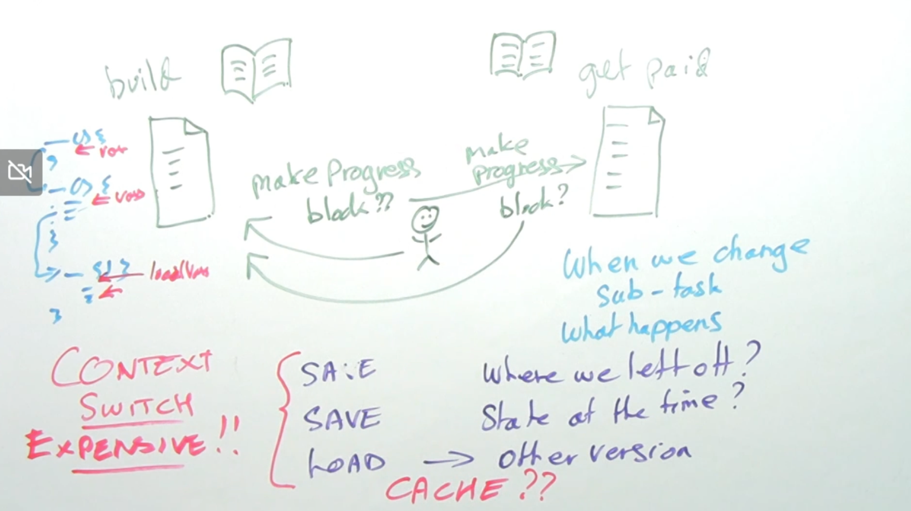

## Learning Concurrency Core Principles
Course and Images by Simon Roberts on Oreilly !

# Context Swtiching
When one task is blocked computer can switch to another task and comeback later to the previous task
We need context swtiching when switching between tasks.
While context swtiching
- Where we left off?
- Whats happening right now with the task
